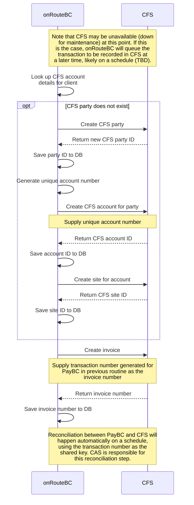

# CFS Sequence for Payment

```mermaid
sequenceDiagram
    participant onRouteBC
    participant CFS
    note over onRouteBC,CFS: Note that CFS may be unavailable (down<br/>for maintenance) at this point. If this<br/>is the case, onRouteBC will queue the<br/>transaction to be recorded in CFS at<br/>a later time, likely on a schedule (TBD).
    onRouteBC->>onRouteBC: Look up CFS account<br/>details for client
    opt CFS party does not exist
        onRouteBC->>CFS: Create CFS party
        CFS-->>onRouteBC: Return new CFS party ID
        onRouteBC->>onRouteBC: Save party ID to DB
        onRouteBC->>onRouteBC: Generate unique account number
        onRouteBC->>CFS: Create CFS account for party
        note over onRouteBC,CFS: Supply unique account number
        CFS-->>onRouteBC: Return CFS account ID
        onRouteBC->>onRouteBC: Save account ID to DB
        onRouteBC->>CFS: Create site for account
        CFS-->>onRouteBC: Return CFS site ID
        onRouteBC->>onRouteBC: Save site ID to DB
    end
    onRouteBC->>CFS: Create invoice
    note over onRouteBC,CFS: Supply transaction number generated for<br/>PayBC in previous routine as the<br/>invoice number
    CFS-->>onRouteBC: Return invoice number
    onRouteBC->>onRouteBC: Save invoice number to DB
    note over onRouteBC,CFS: Reconciliation between PayBC and CFS will<br/>happen automatically on a schedule,<br/>using the transaction number as the<br/>shared key. CAS is responsible for<br/>this reconciliation step.
```