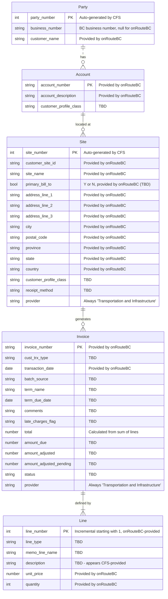

# Data Model for Credit Accounts in CFS

This ERD describes the structure of credit accounts and transactions against those accounts as recorded in CFS.

```mermaid
erDiagram
    Party ||..o{ Account : has
    Party {
        int party_number PK "Auto-generated by CFS"
        string business_number "BC business number, null for onRouteBC"
        string customer_name "Provided by onRouteBC"
    }
    Account ||--o{ Site : "located at"
    Account {
        string account_number PK "Provided by onRouteBC"
        string account_description "Provided by onRouteBC"
        string customer_profile_class "TBD"
    }
    Site ||--o{ Invoice : generates
    Site {
        int site_number PK "Auto-generated by CFS"
        string customer_site_id "Provided by onRouteBC"
        string site_name "Provided by onRouteBC"
        bool primary_bill_to "Y or N, provided by onRouteBC (TBD)"
        string address_line_1 "Provided by onRouteBC"
        string address_line_2 "Provided by onRouteBC"
        string address_line_3 "Provided by onRouteBC"
        string city "Provided by onRouteBC"
        string postal_code "Provided by onRouteBC"
        string province "Provided by onRouteBC"
        string state "Provided by onRouteBC"
        string country "Provided by onRouteBC"
        string customer_profile_class "TBD"
        string receipt_method "TBD"
        string provider "Always 'Transportation and Infrastructure'"
    }
    Invoice ||--|{ Line : "defined by"
    Invoice {
        string invoice_number PK "Provided by onRouteBC"
        string cust_trx_type "TBD"
        date transaction_date "Provided by onRouteBC"
        string batch_source "TBD"
        string term_name "TBD"
        date term_due_date "TBD"
        string comments "TBD"
        string late_charges_flag "TBD"
        number total "Calculated from sum of lines"
        number amount_due "TBD"
        number amount_adjusted "TBD"
        number amount_adjusted_pending "TBD"
        string status "TBD"
        string provider "Always 'Transportation and Infrastructure'"
    }
    Line {
        int line_number PK "Incremental starting with 1, onRouteBC-provided"
        string line_type "TBD"
        string memo_line_name "TBD"
        string description "TBD - appears CFS-provided"
        number unit_price "Provided by onRouteBC"
        int quantity "Provided by onRouteBC"
    }
```