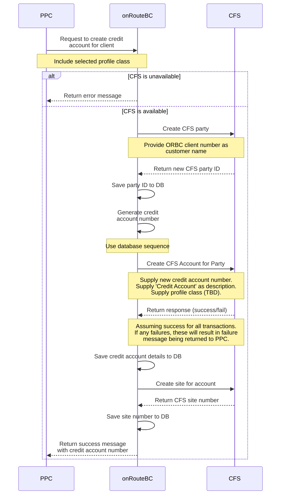

# Sequence to create a new credit account in onRouteBC
Note that this is used for clients who do not have a pre-existing credit account in TPS.

```mermaid
sequenceDiagram
    participant PPC
    participant onRouteBC
    participant CFS
    PPC->>onRouteBC: Request to create credit<br/>account for client
    note over PPC, onRouteBC: Include selected profile class
    alt CFS is unavailable
        onRouteBC-->>PPC: Return error message
    else CFS is available
        onRouteBC->>CFS: Create CFS party
        note over onRouteBC,CFS: Provide ORBC client number as<br/>customer name
        CFS-->>onRouteBC: Return new CFS party ID
        onRouteBC->>onRouteBC: Save party ID to DB
        onRouteBC->>onRouteBC: Generate credit<br/>account number
        note over onRouteBC: Use database sequence
        onRouteBC->>CFS: Create CFS Account for Party
        note over onRouteBC,CFS: Supply new credit account number.<br/>Supply 'Credit Account' as description.<br/>Supply profile class (TBD).
        CFS-->>onRouteBC: Return response (success/fail)
        note over CFS, onRouteBC: Assuming success for all transactions.<br/>If any failures, these will result in failure<br/>message being returned to PPC.
        onRouteBC->>onRouteBC: Save credit account details to DB
        onRouteBC->>CFS: Create site for account
        CFS-->>onRouteBC: Return CFS site number
        onRouteBC->>onRouteBC: Save site number to DB
        onRouteBC-->>PPC: Return success message<br/>with credit account number
    end
```