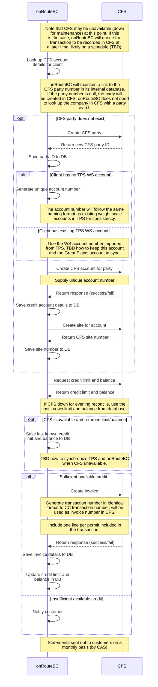

# CFS Sequence for Payment on Credit Account

This sequence diagram describes the process whereby a customer purchases one or more permits on account from onRouteBC.

```mermaid
sequenceDiagram
    participant onRouteBC
    participant CFS
    note over onRouteBC,CFS: Note that CFS may be unavailable (down<br/>for maintenance) at this point. If this<br/>is the case, onRouteBC will queue the<br/>transaction to be recorded in CFS at<br/>a later time, likely on a schedule (TBD).
    onRouteBC->>onRouteBC: Look up CFS account<br/>details for client
    note over onRouteBC,CFS: onRouteBC will maintain a link to the <br/>CFS party number in its internal database.<br/>If the party number is null, the party will<br/>be created in CFS. onRouteBC does not need<br/>to look up the company in CFS with a party<br/>search.
    opt CFS party does not exist
        onRouteBC->>CFS: Create CFS party
        CFS-->>onRouteBC: Return new CFS party ID
        onRouteBC->>onRouteBC: Save party ID to DB
        alt Client has no TPS WS account
            onRouteBC->>onRouteBC: Generate unique account number
            note over onRouteBC,CFS: The account number will follow the same<br/>naming format as existing weight scale<br/>accounts in TPS for consistency.
        else Client has existing TPS WS account
            note over onRouteBC,CFS: Use the WS account number imported<br/>from TPS. TBD how to keep this account<br/>and the Great Plains account in sync.
        end
        onRouteBC->>CFS: Create CFS account for party
        note over onRouteBC,CFS: Supply unique account number
        CFS-->>onRouteBC: Return response (success/fail)
        onRouteBC->>onRouteBC: Save credit account details to DB
        onRouteBC->>CFS: Create site for account
        CFS-->>onRouteBC: Return CFS site number
        onRouteBC->>onRouteBC: Save site number to DB
    end
    onRouteBC->>CFS: Request credit limit and balance
    CFS-->>onRouteBC: Return credit limit and balance
    note over onRouteBC,CFS: If CFS down for evening reconcile, use the<br/>last known limit and balance from database.
    opt CFS is available and returned limit/balance
        onRouteBC->>onRouteBC: Save last known credit<br/>limit and balance to DB
        note over onRouteBC,CFS: TBD how to synchronize TPS and onRouteBC<br/>when CFS unavailable.
    end
    alt Sufficient available credit
        onRouteBC->>CFS: Create invoice
        note over onRouteBC,CFS: Generate transaction number in identical<br/>format to CC transaction number, will be<br/>used as invoice number in CFS.
        note over onRouteBC,CFS: Include one line per permit included in<br/>the transaction.
        CFS-->>onRouteBC: Return response (success/fail)
        onRouteBC->>onRouteBC: Save invoice details to DB
        onRouteBC->>onRouteBC: Update credit limit and<br/>balance in DB
    else Insufficient available credit
        onRouteBC->>onRouteBC: Notify customer
    end
    note over onRouteBC,CFS: Statements sent out to customers on a<br/>monthly basis (by CAS)
```