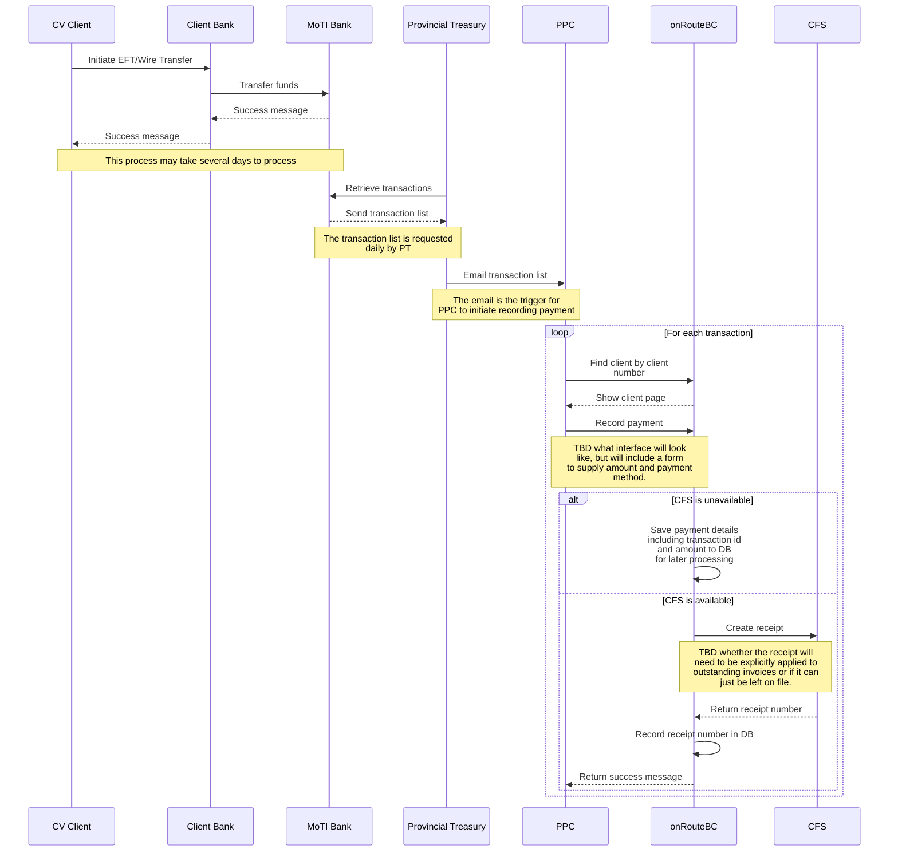

# Sequence to make a payment against a credit account via EFT/Wire Transfer

```mermaid
sequenceDiagram
    participant cvc as CV Client
    participant cbank as Client Bank
    participant mbank as MoTI Bank
    participant pt as Provincial Treasury
    participant PPC
    participant onRouteBC
    participant CFS
    cvc->>cbank: Initiate EFT/Wire Transfer
    cbank->>mbank: Transfer funds
    mbank-->>cbank: Success message
    cbank-->>cvc: Success message
    note over cvc,mbank: This process may take several days to process
    pt->>mbank: Retrieve transactions
    mbank-->>pt: Send transaction list
    note over mbank,pt: The transaction list is requested<br/>daily by PT
    pt->>PPC: Email transaction list
    note over pt,PPC: The email is the trigger for<br/>PPC to initiate recording payment
    loop For each transaction
        PPC->>onRouteBC: Find client by client<br/>number
        onRouteBC-->>PPC: Show client page
        PPC->>onRouteBC: Record payment
        note over PPC,onRouteBC: TBD what interface will look<br/>like, but will include a form<br/>to supply amount and payment<br/>method.
        alt CFS is unavailable
            onRouteBC->>onRouteBC: Save payment details<br/>including transaction id<br/>and amount to DB<br/>for later processing
        else CFS is available
            onRouteBC->>CFS: Create receipt
            note over onRouteBC,CFS: TBD whether the receipt will<br/>need to be explicitly applied to<br/>outstanding invoices or if it can<br/>just be left on file.
            CFS-->>onRouteBC: Return receipt number
            onRouteBC->>onRouteBC: Record receipt number in DB
            onRouteBC-->>PPC: Return success message
        end
    end
```