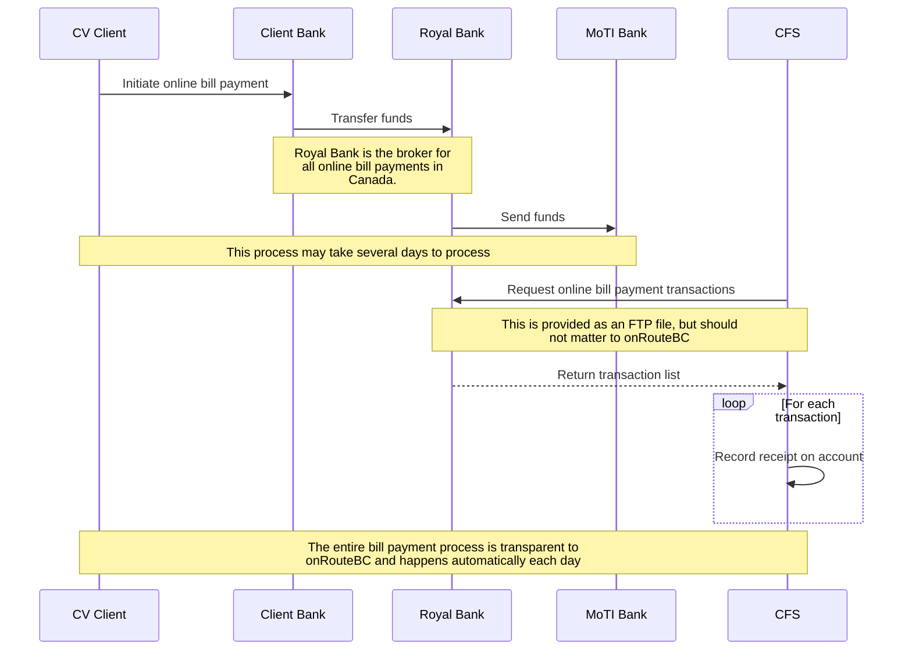

# Sequence to make a payment against a credit account via online banking bill payment

```mermaid
sequenceDiagram
    participant cvc as CV Client
    participant cbank as Client Bank
    participant rbank as Royal Bank
    participant mbank as MoTI Bank
    participant CFS
    cvc->>cbank: Initiate online bill payment
    cbank->>rbank: Transfer funds
    note over cbank,rbank: Royal Bank is the broker for<br/>all online bill payments in<br/>Canada.
    rbank->>mbank: Send funds
    note over cvc,mbank: This process may take several days to process
    CFS->>rbank: Request online bill payment transactions
    note over CFS,rbank: This is provided as an FTP file, but should<br/>not matter to onRouteBC
    rbank-->>CFS: Return transaction list
    loop For each transaction
        CFS->>CFS: Record receipt on account
    end
    note over cvc,CFS: The entire bill payment process is transparent to <br/>onRouteBC and happens automatically each day
```