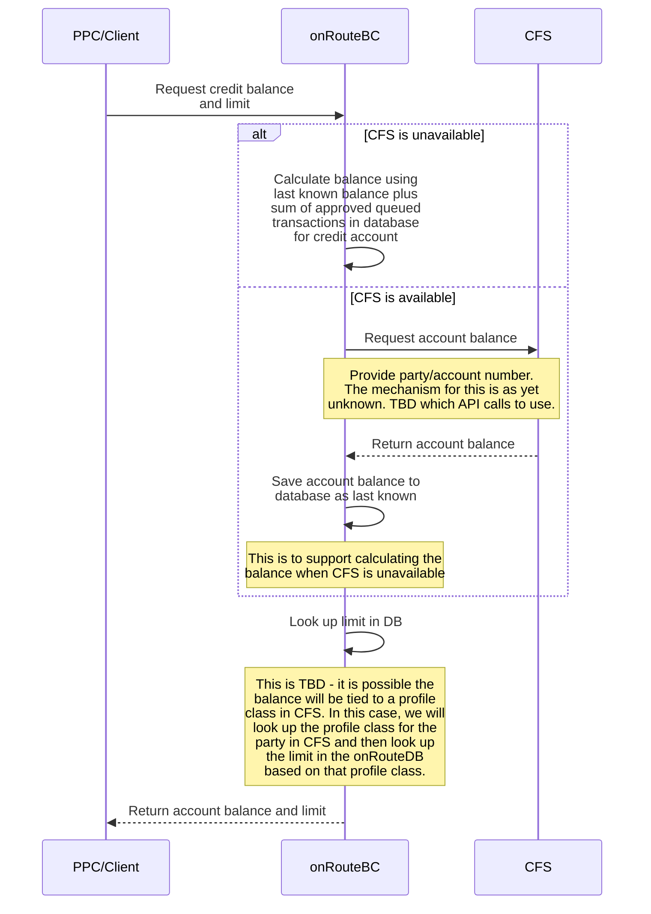

# Sequence to retrieve a credit account balance
This is specific to onRouteBC retrieving credit account balance and credit limit; TPS does not use this approach.

```mermaid
sequenceDiagram
    participant User as PPC/Client
    participant onRouteBC
    participant CFS
    User->>onRouteBC: Request credit balance<br/>and limit
    alt CFS is unavailable
        onRouteBC->>onRouteBC: Calculate balance using<br/>last known balance plus<br/>sum of approved queued<br/>transactions in database<br/>for credit account
    else CFS is available
        onRouteBC->>CFS: Request account balance
        note over onRouteBC,CFS: Provide party/account number.<br/>The mechanism for this is as yet<br/>unknown. TBD which API calls to use.
        CFS-->>onRouteBC: Return account balance
        onRouteBC->>onRouteBC: Save account balance to<br/>database as last known
        note over onRouteBC: This is to support calculating the<br/>balance when CFS is unavailable
    end
    onRouteBC->>onRouteBC: Look up limit in DB
    note over onRouteBC: This is TBD - it is possible the<br/>balance will be tied to a profile<br/>class in CFS. In this case, we will<br/>look up the profile class for the<br/>party in CFS and then look up<br/>the limit in the onRouteDB<br/>based on that profile class.
    onRouteBC-->>User: Return account balance and limit
```