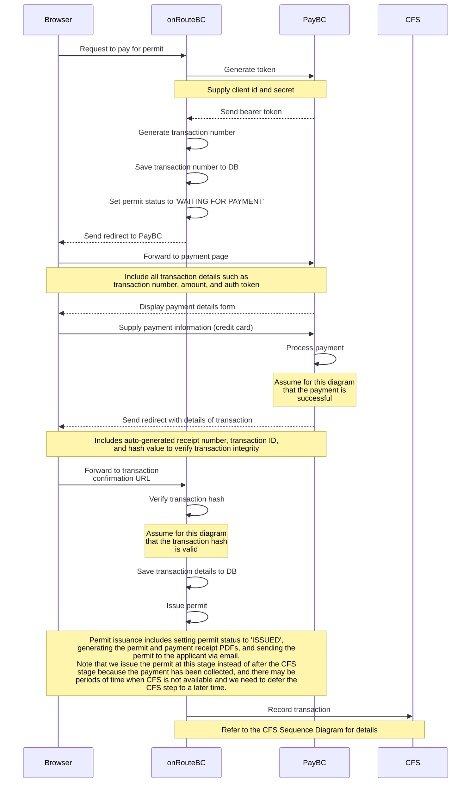

# PayBC Sequence for Payment

```mermaid
sequenceDiagram
    participant Browser
    participant onRouteBC
    participant PayBC
    participant CFS
    Browser->>onRouteBC: Request to pay for permit
    onRouteBC->>PayBC: Generate token
    note over onRouteBC,PayBC: Supply client id and secret
    PayBC-->>onRouteBC: Send bearer token
    onRouteBC->>onRouteBC: Generate transaction number
    onRouteBC->>onRouteBC: Save transaction number to DB
    onRouteBC->>onRouteBC: Set permit status to 'WAITING FOR PAYMENT'
    onRouteBC-->>Browser: Send redirect to PayBC
    Browser->>PayBC: Forward to payment page
    note over Browser,PayBC: Include all transaction details such as<br/>transaction number, amount, and auth token
    PayBC-->>Browser: Display payment details form
    Browser->>PayBC: Supply payment information (credit card)
    PayBC->>PayBC: Process payment
    note over PayBC: Assume for this diagram<br/>that the payment is<br/>successful
    PayBC-->>Browser: Send redirect with details of transaction
    note over Browser,PayBC: Includes auto-generated receipt number, transaction ID,<br/>and hash value to verify transaction integrity
    Browser->>onRouteBC: Forward to transaction<br/>confirmation URL
    onRouteBC->>onRouteBC: Verify transaction hash
    note over onRouteBC: Assume for this diagram<br/>that the transaction hash<br/>is valid
    onRouteBC->>onRouteBC: Save transaction details to DB
    onRouteBC->>onRouteBC: Issue permit
    note over Browser,PayBC: Permit issuance includes setting permit status to 'ISSUED',<br/>generating the permit and payment receipt PDFs, and sending the<br/>permit to the applicant via email.<br/>Note that we issue the permit at this stage instead of after the CFS<br/>stage because the payment has been collected, and there may be<br/>periods of time when CFS is not available and we need to defer the<br/>CFS step to a later time.
    onRouteBC->>CFS: Record transaction
    note over onRouteBC,CFS: Refer to the CFS Sequence Diagram for details
```