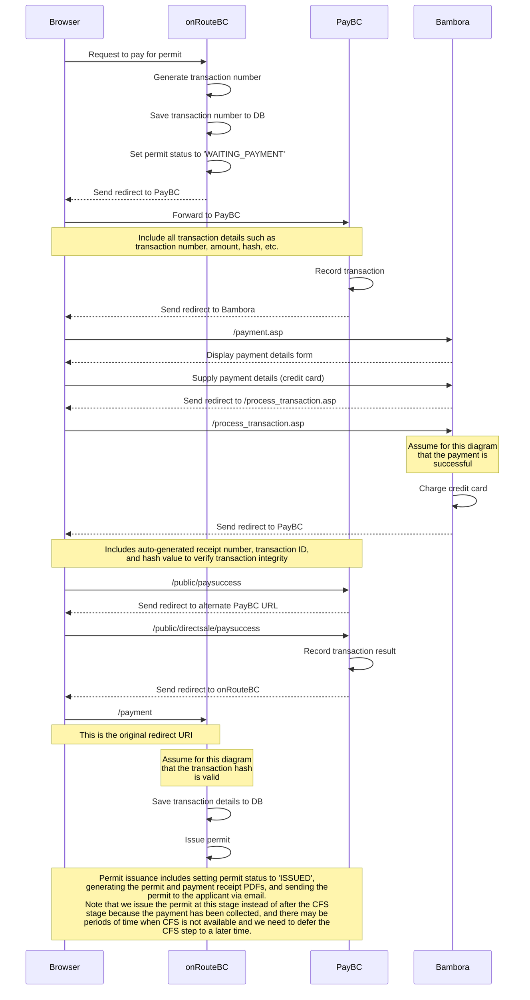

# PayBC Sequence for Payment

```mermaid
sequenceDiagram
    Browser->>onRouteBC: Request to pay for permit
    onRouteBC->>onRouteBC: Generate transaction number
    onRouteBC->>onRouteBC: Save transaction number to DB
    onRouteBC->>onRouteBC: Set permit status to 'WAITING_PAYMENT'
    onRouteBC-->>Browser: Send redirect to PayBC
    Browser->>PayBC: Forward to PayBC
    note over Browser,PayBC: Include all transaction details such as<br/>transaction number, amount, hash, etc.
    PayBC->>PayBC: Record transaction
    PayBC-->>Browser: Send redirect to Bambora
    Browser->>Bambora: /payment.asp
    Bambora-->>Browser: Display payment details form
    Browser->>Bambora: Supply payment details (credit card)
    Bambora-->>Browser: Send redirect to /process_transaction.asp
    Browser->>Bambora: /process_transaction.asp
    note over Bambora: Assume for this diagram<br/>that the payment is<br/>successful
    Bambora->>Bambora: Charge credit card
    Bambora-->>Browser: Send redirect to PayBC
    note over Browser,PayBC: Includes auto-generated receipt number, transaction ID,<br/>and hash value to verify transaction integrity
    Browser->>PayBC: /public/paysuccess
    PayBC-->>Browser: Send redirect to alternate PayBC URL
    Browser->>PayBC: /public/directsale/paysuccess
    PayBC->>PayBC: Record transaction result
    PayBC-->>Browser: Send redirect to onRouteBC
    Browser->>onRouteBC: /payment
    Note over Browser,onRouteBC: This is the original redirect URI
    note over onRouteBC: Assume for this diagram<br/>that the transaction hash<br/>is valid
    onRouteBC->>onRouteBC: Save transaction details to DB
    onRouteBC->>onRouteBC: Issue permit
    note over Browser,PayBC: Permit issuance includes setting permit status to 'ISSUED',<br/>generating the permit and payment receipt PDFs, and sending the<br/>permit to the applicant via email.<br/>Note that we issue the permit at this stage instead of after the CFS<br/>stage because the payment has been collected, and there may be<br/>periods of time when CFS is not available and we need to defer the<br/>CFS step to a later time.
```