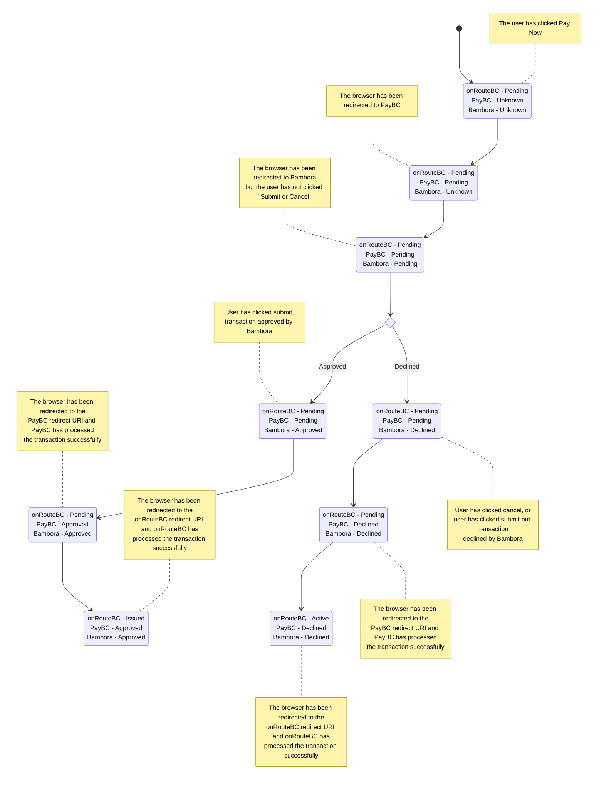

# PayBC State Diagram for Payment

```mermaid
stateDiagram-v2
    s1: onRouteBC - Pending<br/>PayBC - Unknown<br/>Bambora - Unknown
    s2: onRouteBC - Pending<br/>PayBC - Pending<br/>Bambora - Unknown
    s3: onRouteBC - Pending<br/>PayBC - Pending<br/>Bambora - Pending
    s4: onRouteBC - Pending<br/>PayBC - Pending<br/>Bambora - Declined
    s5: onRouteBC - Pending<br/>PayBC - Pending<br/>Bambora - Approved
    s6: onRouteBC - Pending<br/>PayBC - Declined<br/>Bambora - Declined
    s7: onRouteBC - Pending<br/>PayBC - Approved<br/>Bambora - Approved
    s8: onRouteBC - Active<br/>PayBC - Declined<br/>Bambora - Declined
    s9: onRouteBC - Issued<br/>PayBC - Approved<br/>Bambora - Approved
    state app_decl <<choice>>
    [*] --> s1
    s1 --> s2
    s2 --> s3
    s3 --> app_decl
    app_decl --> s5 : Approved
    s5 --> s7
    s7 --> s9
    app_decl --> s4 : Declined
    s4 --> s6
    s6 --> s8
    note left of s1
        The user has clicked Pay Now
    end note
    note left of s2
        The browser has been redirected to PayBC
    end note
    note left of s3
        The browser has been redirected to Bambora
        but the user has not clicked Submit or Cancel
    end note
    note left of s5
        User has clicked submit,
        transaction approved by Bambora
    end note
    note right of s4
        User has clicked cancel, or
        user has clicked submit but transaction
        declined by Bambora
    end note
    note left of s7
        The browser has been redirected to the
        PayBC redirect URI and PayBC has processed
        the transaction successfully
    end note
    note right of s6
        The browser has been redirected to the
        PayBC redirect URI and PayBC has processed
        the transaction successfully
    end note
    note left of s9
        The browser has been redirected to the
        onRouteBC redirect URI and onRouteBC has
        processed the transaction successfully
    end note
    note right of s8
        The browser has been redirected to the
        onRouteBC redirect URI and onRouteBC has
        processed the transaction successfully
    end note
```