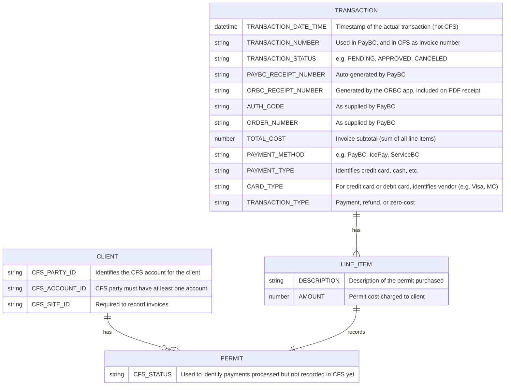

# Data Model for Payment Process

This ERD describes the updates to the existing ORBC data model required to support payment transactions.

```mermaid
erDiagram
    CLIENT ||--o{ PERMIT : has
    CLIENT {
        string CFS_PARTY_ID "Identifies the CFS account for the client"
        string CFS_ACCOUNT_ID "CFS party must have at least one account"
        string CFS_SITE_ID "Required to record invoices"
    }
    TRANSACTION ||--|{ LINE_ITEM: has
    TRANSACTION {
        datetime TRANSACTION_DATE_TIME "Timestamp of the actual transaction (not CFS)"
        string TRANSACTION_NUMBER "Used in PayBC, and in CFS as invoice number"
        string TRANSACTION_STATUS "e.g. PENDING, APPROVED, CANCELED"
        string PAYBC_RECEIPT_NUMBER "Auto-generated by PayBC"
        string ORBC_RECEIPT_NUMBER "Generated by the ORBC app, included on PDF receipt"
        string AUTH_CODE "As supplied by PayBC"
        string ORDER_NUMBER "As supplied by PayBC"
        number TOTAL_COST "Invoice subtotal (sum of all line items)"
        string PAYMENT_METHOD "e.g. PayBC, IcePay, ServiceBC"
        string PAYMENT_TYPE "Identifies credit card, cash, etc."
        string CARD_TYPE "For credit card or debit card, identifies vendor (e.g. Visa, MC)"
        string TRANSACTION_TYPE "Payment, refund, or zero-cost"
    }
    LINE_ITEM {
        string DESCRIPTION "Description of the permit purchased"
        number AMOUNT "Permit cost charged to client"
    }
    LINE_ITEM ||--|| PERMIT: records
    PERMIT {
        string CFS_STATUS "Used to identify payments processed but not recorded in CFS yet"
    }
```