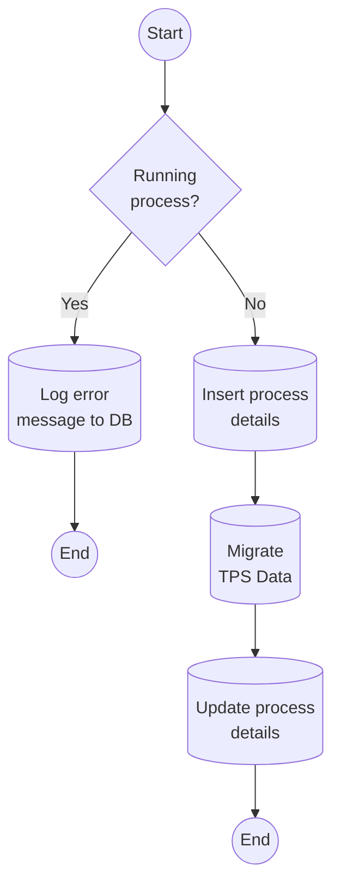
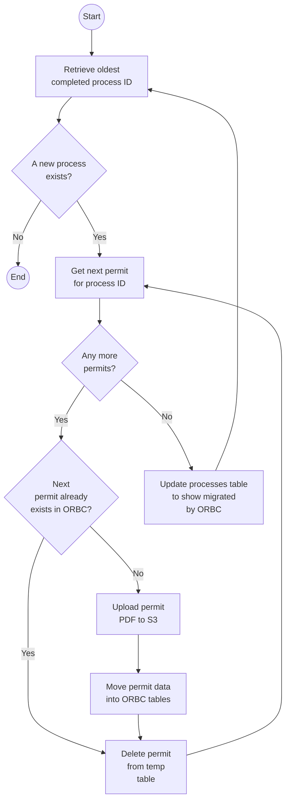
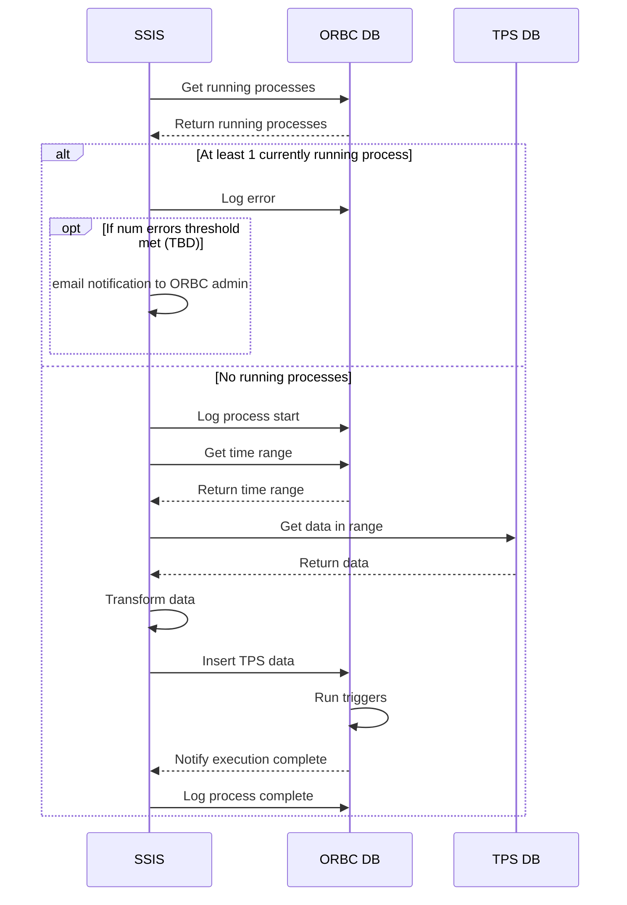

# TPS Data Migration Approach
## Flow
The following flow diagram outlines at a high level the process executed on a pre-determined schedule (TBD) for data synchronization between TPS and onRouteBC.

The following diagram outlines the flow executed on the same schedule as the SSIS / data migration flow above. This is to be executed from the ORBC environment (backend pod or new pod, TBD)

### Notes
* Retrieving the oldest completed process ID will get the process ID of the record from the ETL processes table that has the oldest END_DATE, and which has a ETL_STATUS code of 0 (meaning no errors), and which has an ORBC_COMPLETE status flag of 0 (meaning ORBC has not yet processed this run).
* The ORBC routine needs to check that the permit does not already exist in ORBC because we have to be able to handle error scenarios where we get duplicate permit entries from SSIS. This could be due to a run that failed partway through, or due to a change made in TPS that we are not interested in capturing such as an update to the permit notes field.
* The final step where ORBC updates the process table involves setting the ORBC_COMPLETE flag to 1 for that process.

## Sequence
The following diagram outlines the sequence of steps between SSIS (ETL tool), the onRouteBC database, and the TPS database.

## Sources of Error
### Overlapping ETL runs
#### Symptom
* An ETL process begins before the previous ETL process has finished
* Could result in database lockups with two processes updating the same destination table
#### Mitigation
* Maintain a processes table in ORBC that records the time a process starts and the time the process finishes
  * As a first step in the ETL process, check the processes table to ensure there are no current running processes, and terminate with a row written to the process errors table if there are current running processes

### Hung process or uncaught error
#### Symptom
* There will be a last row in the processes table with a start date but no end date
* There will be multiple records in the process error table, indicating multiple times that the ETL process did not start because of an existing process in progress.
#### Mitigation
* Send an email from SSIS to the onRouteBC administrator and the DBA after a configurable number of such consecutive failures.

### SQL query failure or other caught error
#### Symptom
* If some SQL queries succeeded before the error, there will be an incomplete dataset in ORBC (only some of the data will have been migrated)
* If the error occurs during the ORBC trigger execution, the data may be in an inconsistent state
* The process start row will have been written, but the process end date will not be written yet into the processes table
#### Mitigation
* In the error handling routine, write an entry into the error log with the error message - this is for diagnosis of the SQL error outside of SSIS if necessary
* Send an email to the onRouteBC administrator and the DBA when an error occurs - it should be infrequent and will require attention.
* In the error handling routine, write the end date of the process into the processes table with a status of 1 to indicate an error occurred.
  * When SSIS retrieves the time range for the TPS query for the next run, it will encompass the period of the previous failed run as well.
* Write the triggers and other ORBC processing routines to gracefully handle receiving duplicate records from TPS
* Write the triggers to encapsulate their processing in transactions as much as possible to minimize inconsistent data

### Failure with SSIS
#### Symptom
* If SSIS failure occurs during an ETL run, there will be similar symptoms to hung process above, except without multiple entries in the process error table since SSIS itself failed
* Potentially inconsistent results in the ORBC database, depending on when the SSIS failure occurred
* Synchronization terminated potentially, if the SSIS error is long-lasting and the schedule does not keep executing via SQL Server Agent
#### Mitigation
* MOTI IMB to monitor status of SSIS
* POTENTIAL - daily summary report of ETL status sent to the onRouteBC administrator with number of ETL runs, timestamp of most recent run, status of most recent run
* Support large data batches in SSIS and the ORBC database, in case a full day's worth (or more) of data needs to be migrated to 'catch up' when SSIS comes back online

### ORBC routine cannot keep up with SSIS routine
#### Symptom
* The ORBC routine that is scheduled to upload permit PDFs to S3 storage via the docs endpoint does not finish before the next batch of records are inserted into the staging table
* There will be a longer lag beteen when a permit is created in TPS and when it is searchable in ORBC
#### Mitigation
* Write ORBC routine to operate on an independent schedule to the SSIS inserts
* Train CVSE officers to search for permits in CVCOM if necessary, if we get to a period of higher lag