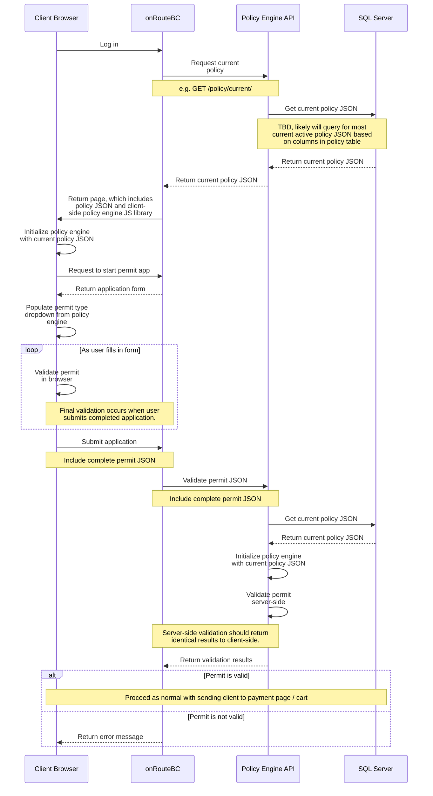

# Basic client server flow for policy engine

## Principles
The policy engine is implemented as a javascript module that can be used server-side with Nodejs, or in the browser.  

When the policy engine is initialized, a JSON file describing policy rules is supplied. When a method of the policy engine is called, it generates its response based on the policy JSON that it was initialized with.

For example, a policy JSON will include a list of all valid permit types, as well as a list of all valid vehicle types. When the getPermitTypes or getVehicleTypes methods are called, the response will be based on just those permit / vehicle types defined in the JSON. Notably, there are no 'built-in' permit or vehicle types - all are defined exclusively in the JSON. This provides maximum flexibility.

The most current policy JSON will describe Commercial Vehicle policy as of right now. This current policy JSON will be stored in the onRouteBC SQL Server database in a column in a table. When changes are made to policy, a new row is added to the table and the old policy JSON is end-dated. There is only ever one current policy JSON at any one time.

It will be possible to retrieve any previous version of policy because all are kept in the database. It is also possible to initialize the policy engine with an arbitrary policy JSON for development and testing purposes. The policy JSON need not be retrieved from the database, the policy engine doesn't care where it comes from.

Initializing the policy engine with a policy JSON that is __not__ the current version is useful in the scenario where new policy rules are being edited and need to be tested thoroughly before going live. In this scenario, the new policy JSON would be in the database in 'draft' state, and the onRouteBC application launched in a test state that will load the specific draft policy JSON instead of current live policy.

The policy JSON in the onRouteBC database will be accessible only through a policy API. This API should be used by the backend as well as the frontend to ensure consistency - make sure the entire application is using the same policy.

Retrieving the current policy JSON could be achieved with a GET request to, for example, /policy/current.

Retrieving a non-current (draft or expired) policy JSON could be achieved with a GET request to the endpoint with ID, for example, /policy/10042 (where 10042 is the ID of the draft policy JSON in the database).

The policy engine javascript library will provide methods for various policy-related tasks in onRouteBC. Examples are getting the list of all valid permit types, getting the list of valid trailer types, getting the list of rules applicable for a specific permit type, and a validate method to check a supplied permit application against policy for any violations or warnings.

Some of these methods are exposed through the policy engine API. For example, a /policy/current/validate method where a policy application JSON is POSTed to it could return an identical result to executing this in the browser in javascript. The policy engine API will simply delegate the call to the policy engine library running in Nodejs in the backend, and package and return the response unmodified.

In this way, a server-side validation of a permit application can be mandatory before a permit is issued, but intermediate validation steps (such as when the client is filling out the permit application form) can be executed quickly in-browser instead of calling back to the server constantly.

### Payload Size
The size of the policy JSON will be reduced by relying on default values for weight and size dimensions, the largest part of policy configuration. When transmitting and storing the policy JSON, the 'dehydrated' and unformatted JSON will be used. When the policy engine is initialized with a policy JSON it will rehydrate it with the weight and size dimension defaults. An 'export' method will dehydrate the policy JSON and return the smaller JSON result.

Rehydration and dehydration on initialization and export simplifies the admin management of policy, since values can be updated directly in the policy engine JSON without having to worry about default values.

